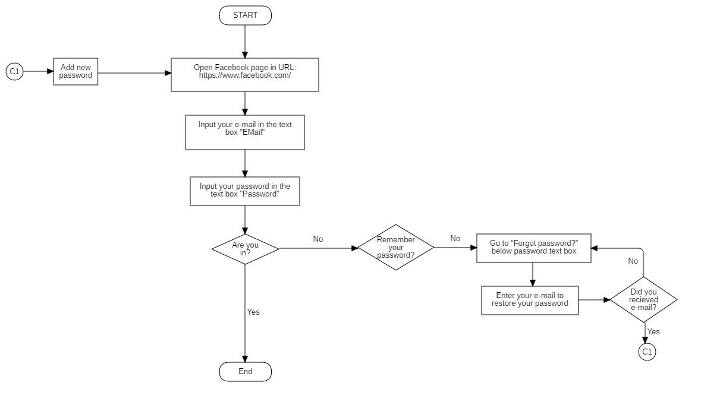
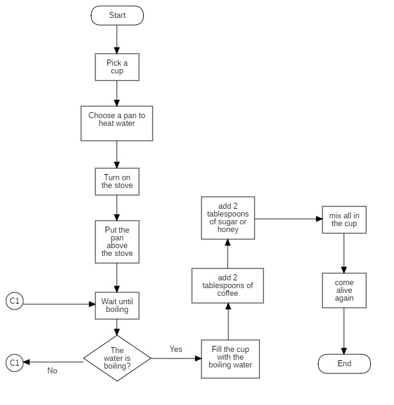
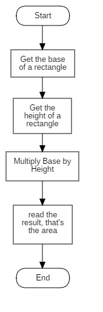

# AlgorithmChallenge

---
## Elaborar estos ejercicios en el lenguaje de su preferencia.

1. Elabora un algoritmo que solicite 2 numeros y muestre el promedio de ambos.

2. Elabora un algoritmo que solicite un número entero y muestre el nombre del mes correspondiente. Ejemplo: Enero = 1.

3. Elaborar un algoritmo que solicite 2 numeros enteros y un operador aritmetico y luego debe de mostrar el resultado de la operacion correspondiente.

4. Elaborar un algoritmo para leer 3 números enteros diferentes entre sí y determinar el número mayor de los tres.

5. Elaborar un algoritmo que necesita obtener el promedio de un estudiante a partir de sus tres notas parciales.

6. Elaborar un algoritmo que solicite la edad de dos personas y muestre en pantalla la edad del mayor.

---
## Elaborar estos ejercicios de diagramas de flujo.


1. Elabora un diagrama de flujo con los pasos para iniciar sesión en una cuenta de Facebook.

2. Elabora un diagrama de flujo con los pasos para preparar cafe.

3. Elabora un diagrama de flujo con los pasos para calcular el área de un rectángulo.


---
## Results
API = ``` http://localhost:3000/ ```

## Algorithms

> 1. ``` http://localhost:3000/Algorithms/One ```

```JSON
// Request
{
	"numberOne": 1416541321,
	"numberTwo": 15416546
}

//Result
{
  "error": false,
  "status": 200,
  "body": {
    "result": 715978933.5
  }
}

```

> 2. ``` http://localhost:3000/Algorithms/Two ```

```JSON
// Request
{
	"number": 12
}

//Result
{
  "error": false,
  "status": 200,
  "body": {
    "result": "Diciembre = 12"
  }
}

```

> 3. ``` http://localhost:3000/Algorithms/Three ```

```JSON
// Request
{
	"numberOne": 12,
	"numberTwo": 24,
	"operator": "*"
}

{
	"numberOne": 12,
	"numberTwo": 24,
	"operator": "/"
}

{
	"numberOne": 12,
	"numberTwo": 24,
	"operator": "+"
}

{
	"numberOne": 12,
	"numberTwo": 24,
	"operator": "-"
}

//Result
{
  "error": false,
  "status": 200,
  "body": {
    "result": "12 * 24 = 288"
  }
}

{
  "error": false,
  "status": 200,
  "body": {
    "result": "12 + 24 = 36"
  }
}

{
  "error": false,
  "status": 200,
  "body": {
    "result": "12 - 24 = -12"
  }
}

{
  "error": false,
  "status": 200,
  "body": {
    "result": "12 / 24 = 0.5"
  }
}

```

> 4. ``` http://localhost:3000/Algorithms/Four ```

```JSON
// Request
{
	"numberOne": 2465677575,
	"numberTwo": 247732,
	"numberThree": 5898
}

//Result
{
  "error": false,
  "status": 200,
  "body": {
    "result": 2465677575
  }
}

```

> 5. ``` http://localhost:3000/Algorithms/Five ```

```JSON
// Request
{
	"numberOne": 10,
	"numberTwo": 9,
	"numberThree": 14
}

//Result
{
  "error": false,
  "status": 200,
  "body": {
    "result": 11
  }
}

```

> 6. ``` http://localhost:3000/Algorithms/Six ```

```JSON
// Request
{
	"numberOne": 100,
	"numberTwo": 190,
	"peopleOne": "Carlos",
	"peopleTwo": "Arturo"
}

//Result
{
  "error": false,
  "status": 200,
  "body": {
    "result": "Arturo es mayor porque tiene 190 años"
  }
}

```
---
## Flow Charts

> 1. ``` http://localhost:3000/FlowChart/Facebook ```



> 2. ``` http://localhost:3000/FlowChart/Coffee ```



> 3. ``` http://localhost:3000/FlowChart/Rectangulo ```

